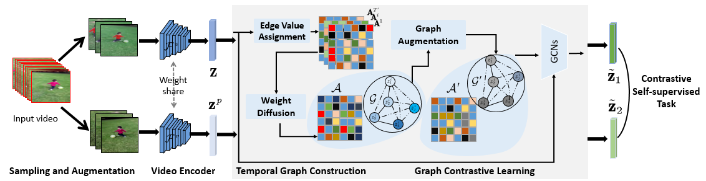
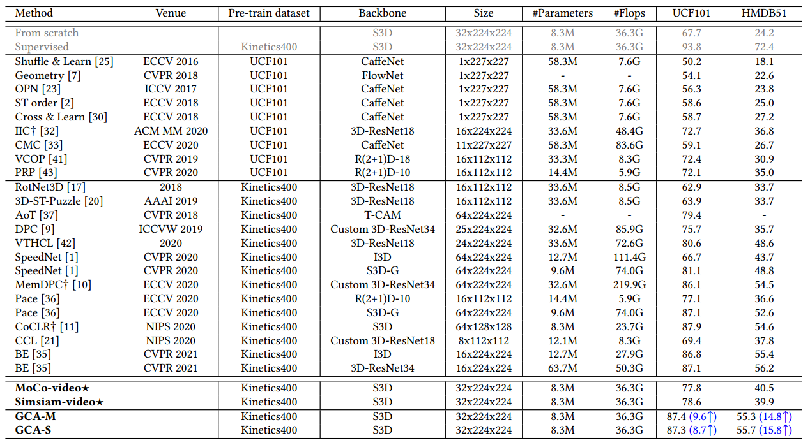
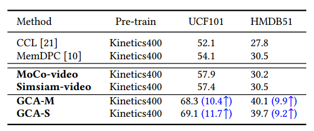
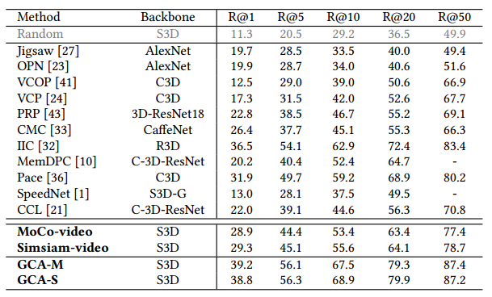
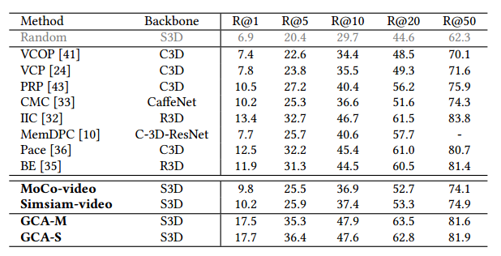
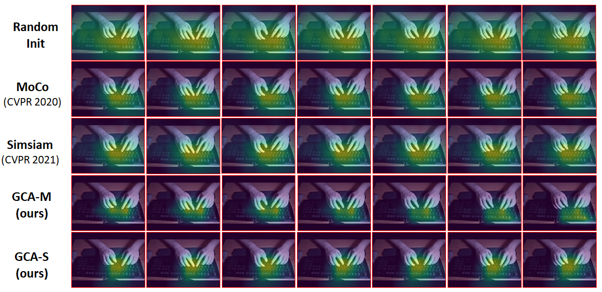
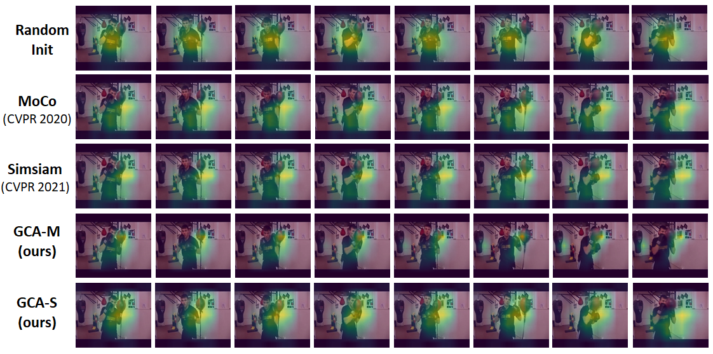
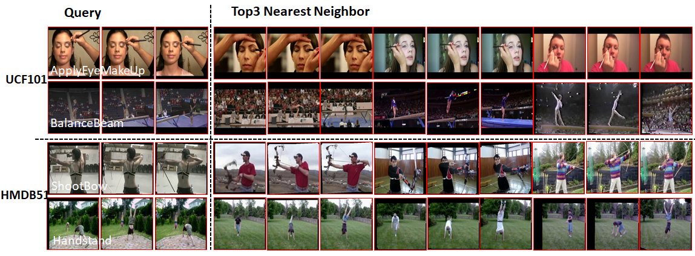

<!-- ## Introduction

This is the source code of paper GCA, **Video Representation Learning with Graph Contrastive Augmentation**. -->
## GCA: Video Representation Learning with Graph Contrastive Augmentation
The source code of the GCA method.  


### Self-supervised Learning
Using the following command to pre-train our model on Kinetics dataset.
```
python ./tools/train_video_contrast_dis.py --confile_file ./configs/confile_file_about_pre_training.yaml
```

### Downstream Tasks
#### Action Recognition
Using the following code to fine-tune or linear probe the pre-trained model on UCF101 or HMDB51 datasets for action recognition.
```
python ./tools/train_ds.py --confile_file ./configs/confile_file_about_fine_tune_or_linear_probe.ymal
```
Using the following code to evaluate the model.
```
python ./tools/test_ds.py
```

#### Video Retrieval
Using the following code to extract features
```
python ./tools/video_retrieval.py --extract_features --dataset
```
Using the following code to retrieval video
```
python ./tools/video_retrieval.py
```

### Motivation of Our Work
We propose a novel contrastive self-supervised video representation learning framework, Graph Contrastive Augmentation (GCA), by constructing a video temporal graph and devising a graph augmentation which is designed to enhance the correlation across frames of videos and developing a new view for exploring temporal structure in videos.

Considering the complexity of videos, except utilizing frame-level spatial view, the additional temporal dimension determines that it is expected to devise a *clip-specific view* for video representation learning.
Previous works ignore the temporal state relation behind the clip, which is an essential part of videos. 
Without the temporal relationship reasoning, the learned representation capability remains limited.
Therefore, we further introduce a temporal contrastive graph to leverage such a relationship behind the consecutive clip, providing stronger supervision for visual encoder training.

<div align="center">

</div>


### Overall Results

**Action Recognition Results of Fine-tune**

<div align="center">

</div>

**Action Recognition Results of Linear Probing**
<div align="center">

</div>


**Video Retrieval Results on UCF101 and HMDB51 Datasets**
<div align="center">
 
</div>


**More CAM Results**
<div align="center">
 
</div>
**More Retrieval Visualization Results**

<div align="center">

</div>